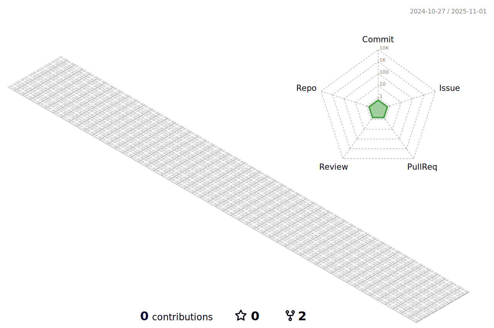

<h1 align="center" style="color: orange;">
    
</h1>

<h3 align="center" style="color: orange;">SDET|QA Test Automation Engineer | Selenium | Selenium Grid | ISTQB | Jira Xray | Jenkins |Cucumber|TestNG|SQL|JDBC|API|html-css|Appium|Cypress|Mulesoft  from TÜRKİYE TR</h3>

  

 &nbsp;&nbsp;&nbsp;

   

  

<h3 align="left" style="color: orange;">Connect with me:</h3>

<h3 align="left" style="color: orange;">Languages and Tools:</h3>

          <a
